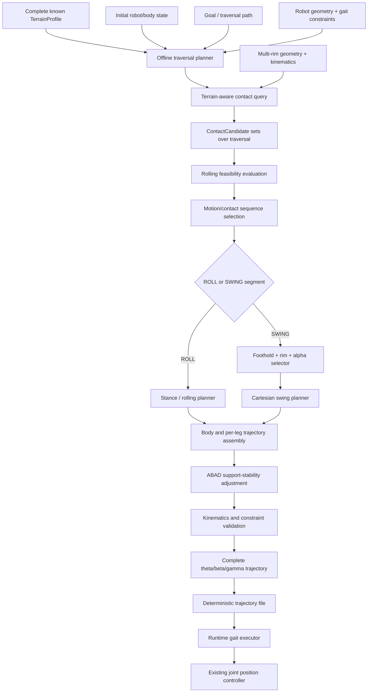

# Hybrid Gait Day 1–2 Architecture Freeze

Status: offline trajectory-level architecture baseline, 2026-08-23.

This document records the Day 1–2 decisions. The scope refinement preserves the existing data contracts and module separation while fixing the ICRA scope to **offline terrain-aware trajectory planning**. Any later architecture change must identify the failed assumption and update the documentation and tests.

## Research question and scope

> **Given a known terrain, what sequence of rolling and stepping contacts should the robot use to traverse the terrain efficiently while satisfying collision-free motion and support-stability constraints?**

Design principle:

> **Given a known terrain, precompute the complete hybrid locomotion trajectory: roll whenever continuous contact is feasible, step only when necessary, and use ABAD to maintain stable support geometry.**

Included in scope:

- known structured asymmetric terrain;
- initially, a horizontal base plane with sparse axis-aligned rectangular obstacles;
- multi-rim contact queries, collision checking, and rolling-feasibility evaluation over the traversal;
- precomputed ROLL/SWING sequence, rim, alpha, footholds, body motion, per-leg stance/swing motion, and ABAD adjustment;
- one deterministic joint-reference trajectory file shared by simulation and hardware.

Rectangular obstacles are the initial development and experimental terrain; they do not restrict the research to staircase traversal.

Explicitly out of scope:

- online perception and unknown-terrain planning;
- depth-camera terrain reconstruction;
- runtime terrain adaptation and receding-horizon replanning;
- real-time high-level planning requirements;
- MPC, reinforcement learning, and whole-body optimization.

At runtime, the robot reads the precomputed trajectory and tracks `theta / beta / gamma` references through the existing low-level joint-position controller. IMU, encoder, motor-current, and Vicon data may support tracking and experimental measurement, but do not drive high-level online replanning.

## Coordinates and units

- `{W}` is a fixed right-handed world frame: `+x` nominally forward, `+y` robot-left, and `+z` upward. Terrain and all public planning targets use `{W}`.
- `{B}` has its origin at the chassis center and aligns with `{W}` at the reference pose. Body pose is `T_W_B`.
- `{M_i}` is the existing kinematic module/hip frame for ABAD module `i`; robot geometry defines `T_B_Mi`.
- Kinematics may convert world-frame footholds, contacts, swing targets, terrain, and body targets into `{B}` or `{M_i}`.
- Lengths use metres and angles use radians. Ambiguous names carry `_m`, `_rad`, and `_world` suffixes.
- `theta`, `beta`, `gamma`, and rim `alpha` retain the existing `CorgiLegKinematics` sign convention.
- The legacy 2D prototype uses `(x,y)=(forward,up)`. Its adapter must map `2D x -> W.x` and `2D y -> W.z`; a legacy 2D vector must never be treated as world XY.

## Frozen data contracts

Executable definitions are in `legwheel.planners.hybrid.types`:

- `TerrainProfile`: the complete known terrain; initially a ground plane plus rectangular obstacles.
- `ContactState`: semantic rim, alpha, world contact point, and terrain surface ID.
- `ContactCandidate`: contact-state data plus terrain gap, edge/rim-transition margin, and collision result.
- `SwingTarget`: touchdown world point, target rim/alpha, and clearance.

Rims use semantic `RimId` values: `foot_rim`, `left_rim`, and `right_rim`. Undocumented legacy integers cannot enter the planning layer. A C++ controller mapping, if needed, belongs in one explicit adapter.

## Offline planner input

```text
TerrainProfile
initial robot / body state
goal / traversal path
robot geometry and kinematics
gait constraints
```

Constraints include joint/workspace limits, collision clearance, contact continuity, minimum stability margin, and gait timing. Inputs are fixed before planning; runtime does not update the terrain model or reselect contacts.

## Offline planner output

The output is a synchronized time series for the complete traversal:

```text
body pose trajectory
per-leg theta / beta / gamma trajectory
per-leg contact state and foothold
per-leg rim / alpha
per-leg ROLL / SWING mode and swing phase
stability margin
```

It is written as deterministic `trajectory.csv`, or an equivalent file with an explicit schema, shared by simulation and the real robot. It contains at least:

```text
time
body_x, body_y, body_z, body_roll, body_pitch, body_yaw
leg0_theta, leg0_beta, leg0_gamma, ... leg3_theta, leg3_beta, leg3_gamma
leg0_mode, leg0_rim, leg0_alpha, ... leg3_mode, leg3_rim, leg3_alpha
leg0_foothold_x, leg0_foothold_y, leg0_foothold_z, ...
stability_margin
```

Mode, rim, contact metadata, body state, and joint references share one time base for reproducible playback, visualization, and analysis.

## Module boundaries and complete planner flow



```text
Known terrain + Initial state + Goal + Constraints
                         ↓
              Offline trajectory planner
                         ↓
       Contact query + collision / rolling feasibility
                         ↓
      Complete ROLL/SWING and contact-state sequence
                         ↓
       Body + stance/swing + ABAD trajectory planning
                         ↓
          Complete theta/beta/gamma references
                         ↓
              deterministic trajectory file
                         ↓
          Runtime playback + low-level tracking
```

## Layer ownership

- **Terrain/contact layer:** geometry queries, collision state, surface IDs, terrain gap, candidates, and edge/rim-transition margins. `query_contact()` remains central and is called repeatedly during offline planning, not robot runtime.
- **Offline hybrid planner:** complete contact/motion sequence, ROLL/SWING primitive selection, rim/alpha/foothold, body targets, stability constraints, and segment transitions. The first version may be deterministic and rule-based.
- **Kinematics:** FK, IK, multi-rim geometry, rolling propagation, joint/workspace limits, and frame transforms.
- **Trajectory assembler / gait executor:** offline assembly synchronizes body, stance, swing, ABAD, and joint samples. Runtime execution reuses duty, phase, `Hybrid::Step()`, `LegModel::move()`, and `next_eta` semantics where practical, but only for playback/dispatch.
- **Controller:** hardware-angle conversion and joint-position reference tracking; no contact selection or terrain replanning.

Terrain reasoning must not be embedded in `Hybrid::Step()` or the motor-command layer. The runtime motor loop must not change ROLL/SWING, footholds, or rims in response to obstacle geometry.

## Core interfaces

```python
query_contact(leg_pose, body_pose, terrain) -> list[ContactCandidate]
check_rolling_feasibility(start_contact, body_path, terrain) -> RollingResult
generate_swing(start_contact, target: SwingTarget, body_path) -> JointTrajectory
plan_hybrid_trajectory(
    terrain,
    initial_state,
    goal,
    robot_model,
    gait_constraints,
) -> HybridTrajectory
write_trajectory(trajectory: HybridTrajectory, path) -> None
```

`query_contact()` supplies multi-rim feasibility and collision data. `check_rolling_feasibility()` validates continuous rolling against geometry, kinematics, and stability. `generate_swing()` handles specified touchdown height, rim, alpha, and clearance. `plan_hybrid_trajectory()` uses these capabilities over the complete terrain. `write_trajectory()` produces the shared deterministic artifact.

Algorithm-specific fields in `RollingResult`, `JointTrajectory`, and `HybridTrajectory` are frozen only when their implementation begins.

## Two-week implementation boundary

```text
Day 1–2   architecture / data-contract freeze
Day 3–5   terrain-aware query_contact()
Day 6–7   rolling feasibility
Day 8–9   swing to different touchdown heights
Day 10–11 offline roll-vs-swing contact/motion sequence planning
Day 12    four-leg full-trajectory integration
Day 13–14 ABAD stability adjustment + trajectory-generation freeze
```

Day 3–5 still implements only `query_contact()`. From Day 10 onward, selection remains a planning-time operation over the complete known terrain, not an online runtime decision.

## Frozen decisions

1. The planner is offline and trajectory-level, not a local runtime selector.
2. Complete terrain, initial state, goal/path, robot model, and constraints are known before planning.
3. The core problem is the complete rolling–stepping contact sequence.
4. Initial terrain is horizontal ground plus known sparse rectangular obstacles.
5. Contact query, collision checking, rolling feasibility, and ABAD stability remain core.
6. Prefer ROLL when feasible; use SWING when geometry, kinematics, or stability prevents rolling.
7. Output a complete synchronized body/contact/mode/joint trajectory and deterministic file.
8. Runtime performs playback and low-level tracking only, with no high-level terrain replanning.
9. Public terrain/contact data use `{W}`, metres, radians, and semantic `RimId`.
10. Joint and alpha signs follow `CorgiLegKinematics`; legacy 2D `(forward,up)` maps to `(W.x,W.z)`.
11. Terrain/contact, offline planner, kinematics, executor, and controller remain separate.
12. Terrain reasoning cannot enter `Hybrid::Step()` or the motor layer.
13. Reuse the legacy stance/swing execution framework where practical.

## Short context for Codex

> Hybrid Gait uses offline trajectory-level planning. Complete structured terrain, initial state, goal/path, robot geometry, and constraints are known before execution. The planner precomputes the complete contact sequence, ROLL/SWING modes, rim/alpha/footholds, body trajectory, ABAD adjustment, and four-leg `theta/beta/gamma` references, then writes a deterministic trajectory file. Runtime only tracks this reference using the existing executor and low-level joint-position controller; it performs no perception, terrain adaptation, or replanning. The next task is `query_contact()` for horizontal ground and known axis-aligned rectangular obstacles. Public terrain/contact data use `{W}`, metres, radians, and semantic `RimId`; legacy 2D `(forward,up)` maps to `(W.x,W.z)`. Preserve module separation and keep terrain reasoning out of `Hybrid::Step()` and the motor layer.
