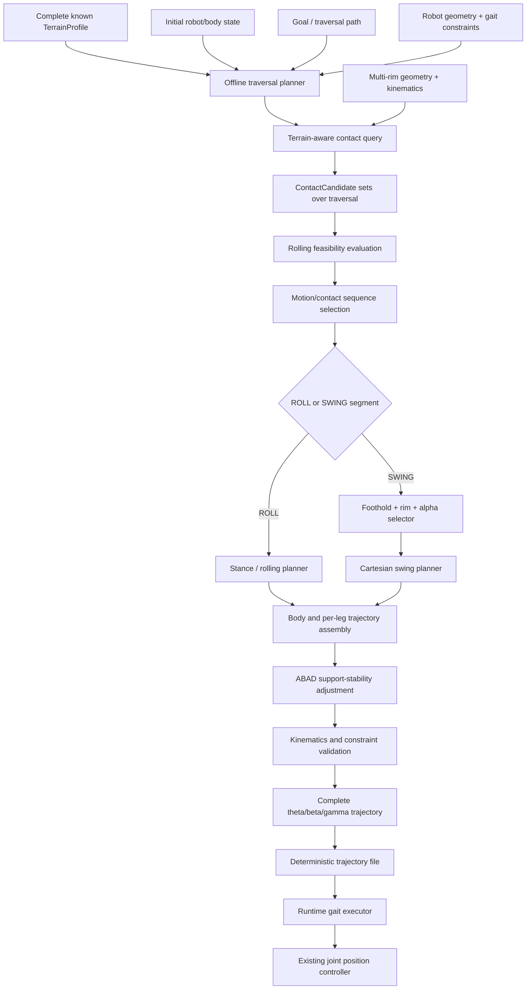

# Hybrid Gait Day 1–2 架構凍結

**狀態：** Offline trajectory-level architecture 基準版本，2026-08-23。

本文件是 Day 1–2 deliverable 的決策紀錄。這次 scope 收斂不推翻既有的資料契約與 module separation，而是明確規定：ICRA 階段只做 **offline terrain-aware trajectory planning**。若後續要修改此架構，應說明哪一項原始假設失效，並同步更新文件與測試。

## 研究問題與範圍

Planner 的核心研究問題是：

> **Given a known terrain, what sequence of rolling and stepping contacts should the robot use to traverse the terrain efficiently while satisfying collision-free motion and support-stability constraints?**

設計原則為：

> **給定已知地形，預先產生完整 hybrid locomotion trajectory：能維持無碰撞連續接觸時就 rolling，只有在必要時才 stepping，並利用 ABAD 維持穩定的支撐幾何。**

### 本階段包含

- 規劃前已知的 structured asymmetric terrain。
- 初期以 horizontal base plane 加上 sparse、axis-aligned rectangular obstacles 表示 2D / 2.5D terrain。
- 對完整 traversal 進行 multi-rim contact query、collision checking 與 rolling feasibility evaluation。
- 預先選擇完整的 ROLL / SWING motion sequence、rim、alpha 與 foothold。
- 預先規劃 body trajectory、四腳 stance / swing trajectory 與 ABAD lateral adjustment。
- 產生 simulation 與 real robot 共用的 deterministic joint-reference trajectory file。

Rectangle obstacle 是初期開發與實驗地形，不表示研究只處理 staircase。

### 本階段不包含

- online perception 或 unknown-terrain planning
- depth-camera terrain reconstruction
- runtime terrain adaptation
- receding-horizon replanning
- real-time high-level planner requirement
- MPC、reinforcement learning 或 whole-body optimization

Robot runtime 只讀取 precomputed trajectory，透過既有 low-level joint position controller 追蹤 `theta / beta / gamma` reference。IMU、encoder、motor current 與 Vicon 可用於 tracking 和實驗量測，但不參與 high-level online replanning。

## 座標系與單位規範

- `{W}` world frame：固定右手座標系；`+x` 沿 nominal course 向前、`+y` 為機器人左側、`+z` 向上。Terrain 與所有 public planning targets 都在此 frame 表示。
- `{B}` body frame：原點位於 chassis center；reference pose 時軸向與 `{W}` 一致。Body pose 使用 `T_W_B`。
- `{M_i}` module/hip frame：第 `i` 隻腳 ABAD module 的既有 kinematic frame；其 transformation 為 `T_B_Mi`，由 robot geometry 決定。
- Public footholds、contact candidates、contact states、swing targets、terrain 與 body targets 一律使用 `{W}`。Kinematics layer 可轉換到 `{B}` / `{M_i}`。
- 位置與長度使用 metre，角度使用 radian。可能有歧義的名稱使用 `_m`、`_rad`、`_world`。
- `theta`、`beta`、`gamma` 與 rim `alpha` 沿用既有 `CorgiLegKinematics` sign convention；planner layer 不重新定義 joint signs。
- Legacy 2D prototype 使用 `(x,y)=(forward,up)`。Adapter boundary 必須 mapping `2D x -> W.x`、`2D y -> W.z`，禁止把舊 2D vector 直接當成 world XY。

## 凍結的 Data Contracts

Executable definitions 位於 `legwheel.planners.hybrid.types`。

### `TerrainProfile`

表示規劃前已知的完整 terrain；第一版為 ground plane 加 rectangular obstacles。

### `ContactState`

包含 selected semantic rim、alpha、world contact point 與 terrain surface ID。

### `ContactCandidate`

包含 contact state 資訊，以及 terrain gap、edge / rim-transition margin 與 collision result。

### `SwingTarget`

包含 touchdown world point、target rim / alpha 與 clearance。

### Rim ID 規範

Planner 使用 semantic `RimId`：

```text
foot_rim
left_rim
right_rim
```

不使用未文件化的 legacy integers。若 C++ controller 需要 integer index，只能在單一明確 adapter 中進行 `RimId -> controller index` mapping。

## Offline Planner Input

完整 planner 的輸入固定為：

```text
TerrainProfile
initial robot / body state
goal / traversal path
robot geometry and kinematics
gait constraints
```

`gait constraints` 至少涵蓋 joint limits、workspace、collision clearance、contact continuity、minimum stability margin 與 gait timing。輸入在規劃開始前確定，runtime 不更新 terrain model 或重新選擇 contact sequence。

## Offline Planner Output

Planner 輸出完整 traversal 的時間序列：

```text
body pose trajectory
per-leg theta / beta / gamma trajectory
per-leg contact state and foothold
per-leg rim / alpha
per-leg ROLL / SWING mode and swing phase
stability margin
```

輸出採 deterministic `trajectory.csv` 或具有等價明確 schema 的 trajectory file，供 simulation 與 real robot 共用。建議至少包含：

```text
time
body_x, body_y, body_z, body_roll, body_pitch, body_yaw

leg0_theta, leg0_beta, leg0_gamma
...
leg3_theta, leg3_beta, leg3_gamma

leg0_mode, leg0_rim, leg0_alpha
...
leg3_mode, leg3_rim, leg3_alpha

leg0_foothold_x, leg0_foothold_y, leg0_foothold_z
...
leg3_foothold_x, leg3_foothold_y, leg3_foothold_z

stability_margin
```

Mode、rim 與 contact metadata 必須與 joint samples 共用同一時間基準，讓結果可以重現、視覺化與分析。

## Module Boundary 與完整 Planner Flow



簡化後：

```text
Complete known terrain + Initial state + Goal + Constraints
                            ↓
                 Offline trajectory planner
                            ↓
        Contact query + collision / rolling feasibility
                            ↓
       Complete ROLL / SWING and contact-state sequence
                            ↓
        Body + stance / swing + ABAD trajectory planning
                            ↓
           Complete theta / beta / gamma references
                            ↓
                  deterministic trajectory file
                            ↓
         Runtime playback + low-level joint tracking
```

## 各 Layer 的責任

### Terrain / Contact Layer

負責 terrain geometry query、collision state、surface ID、terrain gap、contact candidates 與 edge / rim-transition margin。`query_contact()` 仍是核心，只是由 offline planner 在規劃過程中重複呼叫，不在 robot runtime 即時計算。

### Offline Hybrid Planner

負責完整 traversal 的 contact / motion sequence、ROLL / SWING primitive selection、target rim / alpha / foothold、body target、stability constraint 與各段連接。第一版可以 deterministic / rule-based，不需要 optimization。

### Kinematics

負責 FK、IK、multi-rim contact geometry、rolling state propagation、joint/workspace limits 與 frame transforms。

### Trajectory Assembler / Gait Executor

Offline trajectory assembler 負責將 body、stance、swing、ABAD 與 joint samples 對齊成完整時間序列。Runtime gait executor 儘量 reuse 舊版 duty、swing phase、stance phase、`Hybrid::Step()`、`LegModel::move()` 與 `next_eta` pipeline，但職責是 playback / dispatch，不做 terrain reasoning。

### Controller

負責 hardware-angle conversion 與 `theta / beta / gamma` joint-position reference tracking，不負責 contact selection 或 terrain replanning。

## 重要架構限制

> **Terrain reasoning 不可直接塞進 `Hybrid::Step()` 或 motor command layer。**

必須維持：

```text
Known terrain
      ↓
Offline contact / motion planning
      ↓
Deterministic full trajectory
      ↓
Runtime gait execution
      ↓
Low-level controller
```

不得在 runtime motor loop 中根據 obstacle height 臨時改變 ROLL / SWING、foothold 或 rim。

## 核心 Interfaces

```python
query_contact(leg_pose, body_pose, terrain) -> list[ContactCandidate]
check_rolling_feasibility(start_contact, body_path, terrain) -> RollingResult
generate_swing(start_contact, target: SwingTarget, body_path) -> JointTrajectory
plan_hybrid_trajectory(
    terrain,
    initial_state,
    goal,
    robot_model,
    gait_constraints,
) -> HybridTrajectory
write_trajectory(trajectory: HybridTrajectory, path) -> None
```

- `query_contact(...)` 查詢某個規劃 sample 的 feasible multi-rim contacts 與 collision information。
- `check_rolling_feasibility(...)` 驗證一段 body motion 是否能維持 continuous、collision-free rim contact，並滿足 kinematic / stability constraints。
- `generate_swing(...)` 對指定 touchdown height、rim 與 alpha 產生 collision-free Cartesian swing。
- `plan_hybrid_trajectory(...)` 對完整 terrain 反覆使用上述能力，產生完整 contact / motion sequence 與 synchronized trajectory。
- `write_trajectory(...)` 輸出 simulation / hardware 共用的 deterministic trajectory artifact。

`RollingResult`、`JointTrajectory` 與 `HybridTrajectory` 的 algorithm-specific fields 在相應開發日再凍結，避免被尚未驗證的演算法假設綁死。

## 兩週實作邊界

```text
Day 1–2
    architecture / data contract freeze

Day 3–5
    terrain-aware query_contact()

Day 6–7
    rolling feasibility

Day 8–9
    swing planner to different touchdown heights

Day 10–11
    offline roll-vs-swing contact / motion sequence planning

Day 12
    four-leg full-trajectory integration

Day 13–14
    ABAD stability adjustment + trajectory generation freeze
```

Day 3–5 仍只實作 `query_contact()`。Day 10 之後的 selector 是 planning-time component：它對完整已知 terrain 產生完整 sequence，不是 runtime online decision。

## Architecture Freeze 決策摘要

1. Planner 是 offline、trajectory-level，不是 local runtime selector。
2. 完整 terrain、initial state、goal/path、robot model 與 constraints 在規劃前已知。
3. 核心問題是選擇完整 rolling–stepping contact sequence，而不只判斷當下一腳是否 swing。
4. 初期 terrain 是 horizontal ground 加 known sparse rectangular obstacles。
5. Contact query、collision checking、rolling feasibility 與 ABAD stability 仍是 planner 核心。
6. Rolling feasible 時優先 ROLL；因 geometry、kinematics 或 stability 不可行時才 SWING。
7. Planner 輸出完整 body/contact/mode/joint 時間序列與 deterministic trajectory file。
8. Runtime 只播放 trajectory 並進行 low-level joint tracking，不做 high-level terrain replanning。
9. Public terrain / contact data 使用 world frame `{W}`；長度用 metre，角度用 radian。
10. `theta / beta / gamma / alpha` 沿用 `CorgiLegKinematics` sign convention。
11. Legacy 2D `(forward,up)` 必須 mapping 到 `(W.x,W.z)`。
12. Rim 使用 semantic `RimId`，不讓 legacy integer 滲透 planner。
13. Terrain/contact、hybrid planner、kinematics、trajectory executor 與 controller 保持清楚 separation。
14. Terrain reasoning 不得進入 `Hybrid::Step()` 或 motor command layer。
15. 舊版 stance / swing execution framework 應儘量 reuse。

## 給 Codex 的短版 Context

> Hybrid Gait 採 offline trajectory-level planning。完整 structured terrain、initial state、goal/path、robot geometry 與 constraints 在執行前已知；planner 預先產生完整 contact sequence、ROLL / SWING modes、rim / alpha / footholds、body trajectory、ABAD adjustment 與四腳 `theta / beta / gamma` reference trajectory，輸出 deterministic trajectory file。Runtime 只以既有 executor 與 low-level joint position controller 追蹤 reference，不做 perception、terrain adaptation 或 replanning。下一步實作 `query_contact()`；第一版 terrain 僅包含 horizontal ground 與 known axis-aligned rectangular obstacles。所有 public contact / terrain data 使用 `{W}`，長度使用 metre、角度使用 radian；legacy 2D `(forward,up)` 必須 mapping 到 `(W.x,W.z)`；rim 使用 semantic `RimId`。保留 terrain/contact、offline planner、kinematics、executor、controller separation，且不得把 terrain reasoning 寫入 `Hybrid::Step()` 或 motor layer。
